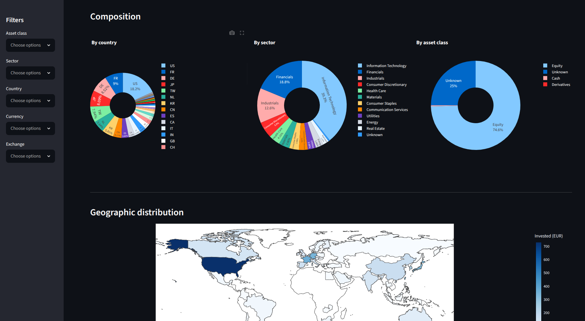

# portfolio-scraper

`portfolio-scraper` is a Python library that scrapes **ETF listings and holdings** from the official Amundi, iShares, Vanguard, and Xtrackers websites and returns them as pandas DataFrames with standardised column names.

Each provider publishes its data in a different format (JSON, CSV, GraphQL), with different column names. Every scraper maps the provider's columns onto a common set of names, so listings and holdings from different providers can be put side by side.

It also ships some **Streamlit apps** to explore the data interactively.

This project stems from my personal desire to understand the actual composition of my portfolio, and I work on it in my spare time, though very slowly. Contributions are welcome to add more scrapers or improve how it works!

Disclaimer: some fields may change in the future, and some mappings are not 100% correct.

## Installation

```bash
pip install portfolio-scraper
```

## Quick start

```python
from portfolio_scraper.etf import ISharesItScraper

scraper = ISharesItScraper()

# All the funds available on the provider's website
listings = scraper.get_listings()
print(listings.head())

# Holdings of a fund (iShares wants its internal id, see below)
holdings = scraper.get_holdings("251911")
print(holdings[["name", "weight", "sector", "country"]].head())
```

## Scrapers

```python
from portfolio_scraper.etf import (
    AmundiScraper,
    ISharesItScraper,
    VanguardItScraper,
    XTrackersItScraper,
)
```

| Class                | Provider          | Region         | Source format | `get_holdings()` identifier |
| -------------------- | ----------------- | -------------- | ------------- | --------------------------- |
| `AmundiScraper`      | Amundi            | All countries¹ | JSON API      | ISIN                        |
| `ISharesItScraper`   | BlackRock iShares | Italy          | JSON + CSV    | `internal_id`               |
| `VanguardItScraper`  | Vanguard          | Italy          | GraphQL       | `internal_id`               |
| `XTrackersItScraper` | DWS Xtrackers     | Italy          | JSON + CSV    | ISIN (= `internal_id`)      |

¹ The Amundi API returns the products of every country, so a single scraper is enough.

The identifier for `get_holdings()` can always be found in the output of `get_listings()`.

### How a scraper works

Every scraper extends `EtfBaseScraper` (`portfolio_scraper/etf/base.py`) and exposes three levels of data, for both listings and holdings:

| Listings                | Holdings                  | Output                                                                                      |
| ----------------------- | ------------------------- | ------------------------------------------------------------------------------------------- |
| `get_raw_listings()`    | `get_raw_holdings(id)`    | The data exactly as returned by the provider                                                |
| `get_issuer_listings()` | `get_issuer_holdings(id)` | The provider's data, cleaned up (flattened fields, readable column names), all columns kept |
| `get_listings()`        | `get_holdings(id)`        | **Standard format**: only the columns below, with the standard names                        |

Use `get_listings()` / `get_holdings()` to combine data across providers. Use the issuer methods when you need a column that exists for one provider only.

The standard format only renames columns: the **values are not normalised** yet. Weights, sector names, countries and asset types keep the provider's scale and language (see the notes under the holdings table).

## Standard format

### Listings

Returned by `get_listings()`. All scrapers provide all the columns.

| Column        | Description                                      | Amundi | iShares | Vanguard | Xtrackers |
| ------------- | ------------------------------------------------ | :----: | :-----: | :------: | :-------: |
| `isin`        | ISIN of the fund                                 |   ✅   |   ✅    |    ✅    |    ✅     |
| `name`        | Name of the fund                                 |   ✅   |   ✅    |    ✅    |    ✅     |
| `internal_id` | Provider's internal id of the fund               |   ✅   |   ✅    |    ✅    |    ✅     |
| `ter`         | Total expense ratio, in percent (`0.20` = 0.20%) |   ✅   |   ✅    |    ✅    |    ✅     |

Notes:

- `internal_id` is an integer for iShares and a string for the others. For Amundi it looks like `dl_<ISIN>`, for Xtrackers it is the ISIN itself.
- The Vanguard listings include mutual funds as well as ETFs.
- `ter` can be missing for some funds.

### Holdings

Returned by `get_holdings(id)`. Columns not provided by a scraper are absent from its DataFrame.

| Column     | Description                  | Amundi | iShares | Vanguard | Xtrackers |
| ---------- | ---------------------------- | :----: | :-----: | :------: | :-------: |
| `ticker`   | Ticker of the holding        |  ✅¹   |   ✅    |    ✅    |    ❌     |
| `isin`     | ISIN of the holding          |   ✅   |   ❌    |    ❌    |    ✅     |
| `name`     | Name of the holding          |   ✅   |   ✅    |    ✅    |    ✅     |
| `weight`   | Weight in the fund           |  ✅²   |   ✅²   |   ✅²    |    ✅²    |
| `sector`   | Sector of the holding        |  ✅³   |   ✅³   |   ✅³    |    ✅³    |
| `type`     | Asset class / security type  |  ✅⁴   |   ✅⁴   |   ✅⁴    |    ❌     |
| `country`  | Country of the holding       |  ✅⁵   |   ✅⁵   |   ✅⁵    |    ✅⁵    |
| `currency` | Currency of the holding      |   ✅   |   ✅    |    ❌    |    ✅     |
| `rating`   | Credit rating of the holding |   ❌   |   ❌    |    ❌    |    ✅     |

Notes (values are the provider's, not normalised):

1. Amundi returns the Bloomberg ticker (e.g. `NVDA UW`).
2. Amundi and Xtrackers express the weight as a fraction (`0.05` = 5%), iShares and Vanguard as a percentage (`5.0` = 5%).
3. Amundi and Vanguard use the GICS sector names in English, iShares and Xtrackers the sector names in Italian.
4. Each provider uses its own labels: e.g. `EQUITY_ORDINARY` (Amundi), `Azionario` (iShares), `EQ.STOCK` (Vanguard).
5. Amundi returns the English country name (country of risk), iShares and Xtrackers the Italian name, Vanguard the ISO 3166-1 alpha-2 code.

### Example: list every fund from every provider

```python
import pandas as pd
from portfolio_scraper.etf import (
    AmundiScraper,
    ISharesItScraper,
    VanguardItScraper,
    XTrackersItScraper,
)

frames = []
for scraper in [AmundiScraper(), ISharesItScraper(), VanguardItScraper(), XTrackersItScraper()]:
    df = scraper.get_listings()
    df["issuer"] = scraper.ISSUER
    frames.append(df)

listings = pd.concat(frames, ignore_index=True)
print(listings[listings["name"].str.contains("MSCI World")].sort_values("ter"))
```

## Streamlit apps

The apps live in the `app/` folder and are meant to be run from the cloned repository with [uv](https://docs.astral.sh/uv/).

1. Install uv, if you don't have it yet:

   ```bash
   curl -LsSf https://astral.sh/uv/install.sh | sh
   ```

2. Clone the repository and install the dependencies. Streamlit and Plotly are part of the `dev` dependency group, which `uv sync` installs by default:

   ```bash
   git clone https://github.com/riccardotornesello/etf-scraping.git
   cd etf-scraping
   uv sync
   ```

3. Launch an app with `uv run`, which runs the command inside the project's virtual environment (no need to activate it):

   ```bash
   uv run streamlit run app/listings.py
   ```

Then open the URL printed in the terminal (default http://localhost:8501). To use a different port, add `--server.port 8502`.

### Listings (`app/listings.py`)

Shows the listings of **all the scrapers in a single table**, with:

- a filter by scraper;
- a text search on name, ISIN and internal id;
- a TER range filter;
- the export of the filtered table as CSV.

Listings are cached for one day; use the _Refresh data_ button in the sidebar to fetch them again.

### Portfolio (`app/app.py`)



Lets you build a portfolio of ETFs (ISIN, scraper, value in euro), import/export it as CSV, scrape and merge all the holdings, and view the allocation by sector, asset type and country.

ETFs are always entered by ISIN: for the scrapers that need the `internal_id`, the app looks it up in the listings. The app also brings weights to the same scale (fraction) and converts countries to ISO alpha-2 codes, so holdings from different providers can be summed. Sector and asset type names are still the providers' ones.

```bash
uv run streamlit run app/app.py
```

## Development

```bash
uv sync
```

Run the tests (they hit the providers' websites, so they need an internet connection):

```bash
uv run pytest
```

Lint and format:

```bash
uv run ruff check
uv run ruff format
```

### Adding a scraper

1. Create a class that extends `EtfBaseScraper` (or the provider's base class, to add a new country).
2. Implement `get_raw_listings()` and `get_raw_holdings(id)`.
3. Optionally override `get_issuer_listings()` / `get_issuer_holdings(id)` to clean up the raw data.
4. Set `LISTINGS_COLUMN_NAMES` and `HOLDINGS_COLUMN_NAMES`, mapping each standard column to the provider's column in the issuer DataFrame.
5. Export it from `portfolio_scraper/etf/__init__.py` and add a test class in `tests/test_etf.py`.

## Disclaimer

This is an **unofficial** project. It is not affiliated with, endorsed by, or supported by Amundi, BlackRock/iShares, Vanguard, DWS/Xtrackers, or any other fund provider. All trademarks belong to their respective owners.

The data is scraped from public websites whose structure and content may change or become unavailable at any time. **No guarantee** is given about the accuracy, completeness, timeliness or availability of the data. It is provided "as is", without warranty of any kind. Do not rely on it for investment decisions - always verify against the providers' official sources. Use at your own risk, and make sure your usage complies with each provider's terms of service.

## Credits

Thanks to https://github.com/mledoze/countries for the countries database.
